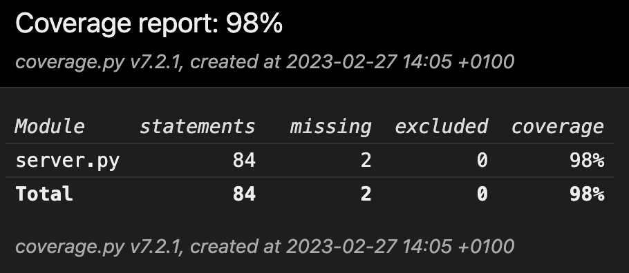
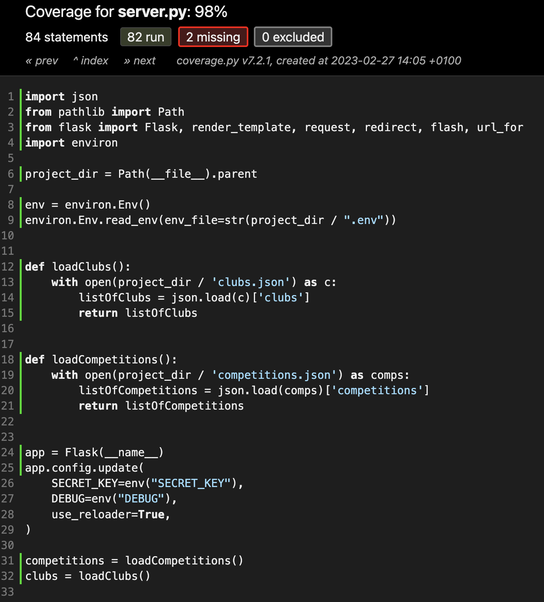
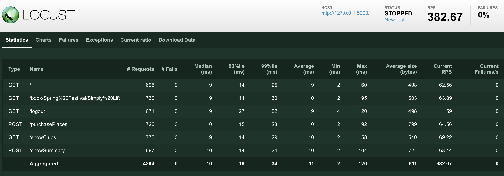

<div id="top"></div>

<!-- PROJECT SHIELDS -->
<!--
*** I'm using markdown "reference style" links for readability.
*** Reference links are enclosed in brackets [ ] instead of parentheses ( ).
*** See the bottom of this document for the declaration of the reference variables
*** for contributors-url, forks-url, etc. This is an optional, concise syntax you may use.
*** https://www.markdownguide.org/basic-syntax/#reference-style-links
-->
[![oc][oc-project-shield]][oc-project-url]
[![testing][testing-shield]][testing-url]
[![unit-testing][unit-testing-shield]][unit-testing-url]
[![pytest][pytest-shield]][pytest-url]
[![pytes-mock][pytest-mock-shield]][pytest-mock-url]
[![pytest-cov][pytest-cov-shield]][pytest-cov-url]
[![debugging][debugging-shield]][debugging-url]
[![bugs][bugs-shield]][bugs-url]
[![qa][qa-shield]][qa-url]
[![coverage][coverage-shield]][coverage-url]
[![locust][locust-shield]][locust-url]

<!-- PROJECT LOGO -->
<br />
<div align="center">

<h1 align="center">OC - PROJECT N°11 - Improve a Python web application through testing and debugging</h1>

  <p align="center">
Güdlft, a digital platform to coordinate strength competitions (deadlifting, strongman) in North America and Australia.   
<br /></p>
</div>

<a href="https://images.unsplash.com/photo-1603736087997-5daec6092347?ixlib=rb-4.0.3&ixid=MnwxMjA3fDB8MHxwaG90by1wYWdlfHx8fGVufDB8fHx8&auto=format&fit=crop&w=1770&q=80"><small>By Jason Richard</small></a>


<!-- ABOUT THE PROJECT -->

## Project Overview

Debug and add tests to a Python web application (https://github.com/OpenClassrooms-Student-Center/Python_Testing).
Generate a test coverage report and a performance report using Locust.

<p align="right">(<a href="#top">back to top</a>)</p>

## Built With

* Python
* Pytest
* Pytest Mock
* Pytest Coverage
* Locust

<p align="right">(<a href="#top">back to top</a>)</p>


<!-- GETTING STARTED -->

## Getting Started

#### Clone the repo
   ```sh
   git clone https://github.com/Jliezed/oc_project_11_gudlft.git
   ```
#### Install venv library (if not yet in your computer)
   ```sh
   pip install venv
   ```
#### Create a virtual environment
   ```sh
   python -m venv env
   ```
#### Activate the virtual environment
   ```sh
   source env/bin/activate
   ```
#### Install the packages using requirements.txt
   ```sh
   pip install -r requirements.txt
   ```

#### Run the application

   ```sh
   export FLASK_APP=server.py
   flask run
   ```

#### Access the app: http://127.0.0.1:5000
   
---


<p align="right">(<a href="#top">back to top</a>)</p>

## Run tests and generate coverage report
#### Run tests
   ```sh
   pytest
   ```
#### Generate coverage report
   ```sh
    pytest --cov
    pytest --cov=. --cov-report html
   ```




---

## Run Locust performance test
#### Run Locust
   ```sh
   cd tests
   cd performance_tests
   locust
   ```


<p align="right">(<a href="#top">back to top</a>)</p>


<!-- MARKDOWN LINKS & IMAGES -->
<!-- https://www.markdownguide.org/basic-syntax/#reference-style-links -->

[oc-project-shield]: https://img.shields.io/badge/OPENCLASSROOMS-PROJECT-blueviolet?style=for-the-badge
[oc-project-url]: https://openclassrooms.com/fr/paths/518-developpeur-dapplication-python

[testing-shield]: https://img.shields.io/badge/-TESTING-blue?style=for-the-badge
[testing-url]: https://en.wikipedia.org/wiki/Software_testing

[unit-testing-shield]: https://img.shields.io/badge/-UNIT%20TESTING-blue?style=for-the-badge
[unit-testing-url]: https://en.wikipedia.org/wiki/Unit_testing

[pytest-shield]: https://img.shields.io/badge/-PYTEST-blue?style=for-the-badge
[pytest-url]: https://docs.pytest.org/en/7.2.x/

[pytest-mock-shield]: https://img.shields.io/badge/-PYTEST%20MOCK-blue?style=for-the-badge
[pytest-mock-url]: https://pypi.org/project/pytest-mock/

[pytest-cov-shield]: https://img.shields.io/badge/-PYTEST%20COV-blue?style=for-the-badge
[pytest-cov-url]: https://pypi.org/project/pytest-cov/

[debugging-shield]: https://img.shields.io/badge/-DEBUGGING-blue?style=for-the-badge
[debugging-url]: https://en.wikipedia.org/wiki/Debugger

[bugs-shield]: https://img.shields.io/badge/-BUGS-blue?style=for-the-badge
[bugs-url]: https://en.wikipedia.org/wiki/Software_bug

[qa-shield]: https://img.shields.io/badge/-QA-blue?style=for-the-badge
[qa-url]: https://en.wikipedia.org/wiki/Quality_assurance

[coverage-shield]: https://img.shields.io/badge/-COVERAGE-blue?style=for-the-badge
[coverage-url]: https://pypi.org/project/pytest-cov/

[locust-shield]: https://img.shields.io/badge/-LOCUST-blue?style=for-the-badge
[locust-url]: https://locust.io

[flask-shield]: https://img.shields.io/badge/-FLASK-blue?style=for-the-badge
[flask-url]: https://flask.palletsprojects.com/en/2.2.x/

